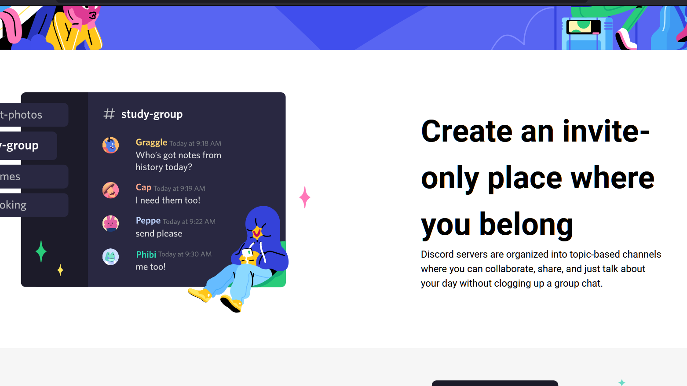
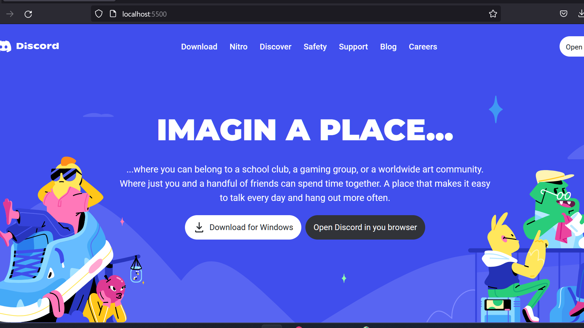

# Discord Homepage Clone

A clone of the Discord homepage using HTML, Tailwind CSS and JavaScript.

## Live Demo

You can see a live demo of this project [https://discordclone-assesment.netlify.app/](https://discordclone-assesment.netlify.app/).

## Screenshots

## Technologies Used

- Tailwind CSS
- JavaScript
- HTML
- CSS

## Installation

1. Clone the repository: `git clone https://github.com/samhtihMR/discord-homepage-clone.git`
2. Navigate to the project directory: `cd Discord-clone`
3. Open the `index.html` file in your browser.

## Usage

1. Open the `index.html` file in your browser.
2. Interact with the webpage to see the clone of the Discord homepage.

